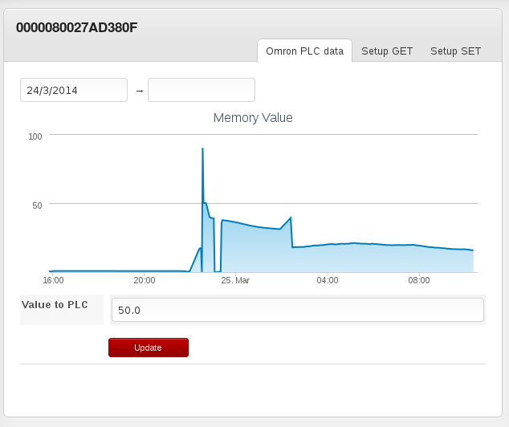
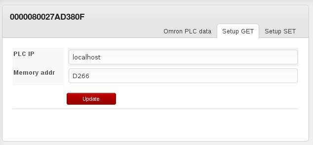
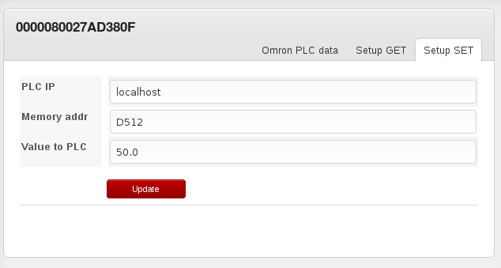

Omron PLC read write
====================

This is simple Dataplicity Application example allowing read/write data to/from Omron PLC via web browser.

The example demonstrate how to:
- monitor simple memory address in graph
- write value to PLC

- setup address for monitoring and writing

Pre-requisites
--------------
- Omron Sysmac PLC with Ethernet module.
- Linux PC ( raspberry can be too)
- Python Omron FINS library (copy is included in this repo)

Setup
------
Please follow the tutorial on http://dataplicity.com/get-started/raspberry-pi/ to setup a dataplicity account and register a application. 
Off course use this application instead of sinewave :-)

Application breakdown is here .

Notes about FINS lib
--------------------
There is two possibility to make FINS: UDP and TCP. There is no difference with one application and one PLC. For multiples apps running on single PC or multiple PLC in network next notes applies for UDP:
- UDP not guaranteed reply
- UDP can handle multicast too
- only one application per PC can make UDP because need to grab 9600 socket. Workaround is use different IP addresses.

References
----------
FINS documentation http://www.omron.com.au/data_pdf/mnu/w343-e1-06_cs1w_cj1w-etn.pdf (chapter 5)
The Omron FINS library: https://bitbucket.org/vladimirek/omronlib
